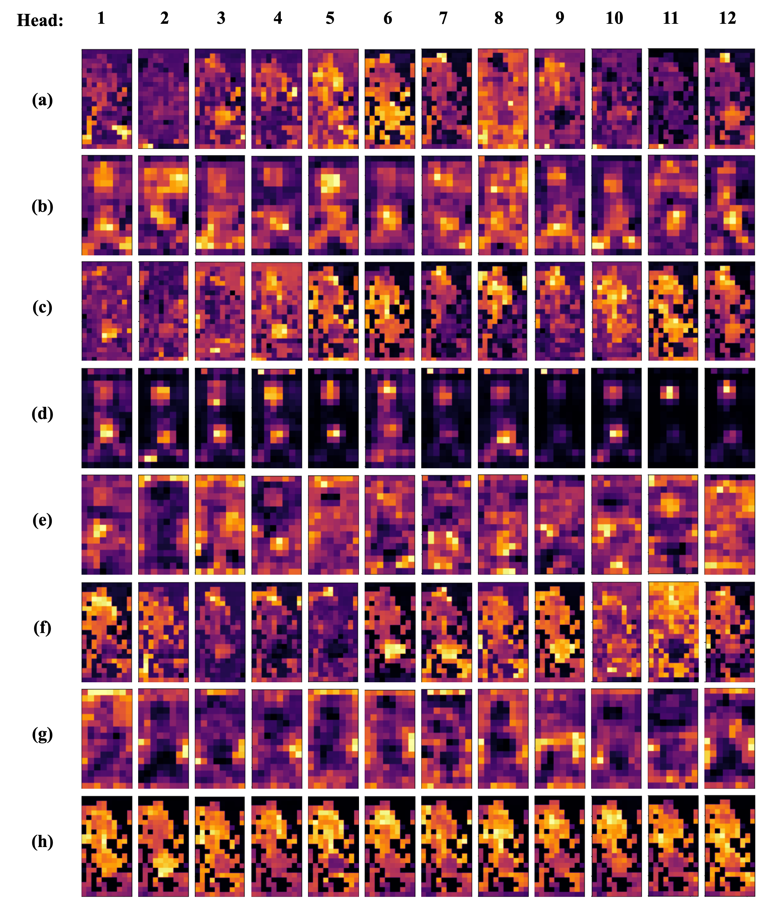

<p align="center">
  <h1 align="center">Unity is Strength: Unifying Convolutional and Transformeral Features for Better Person Re-Identification</h1>
  <p align="center">
    
  <p align="center">
    <a href="https://scholar.google.com/citations?user=WZvjVLkAAAAJ&hl=zh-CN" rel="external nofollow noopener" target="_blank"><strong>Yuhao Wang</strong></a>
    ·
    <a href="https://scholar.google.com/citations?user=MfbIbuEAAAAJ&hl=zh-CN" rel="external nofollow noopener" target="_blank"><strong>Pingping Zhang*</strong></a>
    ·
    <a href="https://scholar.google.com/citations?user=6R4C_6wAAAAJ&hl=zh-CN&oi=sra" rel="external nofollow noopener" target="_blank"><strong>Xuehu Liu</strong></a>
    ·
    <a href="https://dblp.org/pid/138/5016.html" rel="external nofollow noopener" target="_blank"><strong>Zhengzheng Tu</strong></a>
    ·
    <a href="https://scholar.google.com/citations?hl=zh-CN&user=D3nE0agAAAAJ" rel="external nofollow noopener" target="_blank"><strong>Huchuan Lu</strong></a>
  </p>
<p align="center">
    <a href="https://arxiv.org/abs/2412.17239" rel="external nofollow noopener" target="_blank">IEEE TITS 2025 Paper</a>


In this paper, we propose a flexible fusion framework named FusionReID for image-based person ReID. 
It comprises a Dual-branch Feature Extraction (DFE) and a Dual-attention Mutual Fusion (DMF). In DFE, we employ CNNs and Transformers to extract deep features from a single image.
Besides, DMF consists of the Local Refinement Unit (LRU) and Heterogenous Transmission Module (HTM). Through the continuous stacking of HTM, we unify heterogenous deep features from CNNs and Transformers. Experiments on three large-scale ReID benchmarks demonstrate that our method attains superior performances than most state-of-the-arts. Since the computation is still high, in the future, we will explore more lightweight fusion methods for the framework.

## News

## Table of Contents

- [Introduction](#introduction)
- [Contributions](#contributions)
- [Results](#results)
- [Visualizations](#visualizations)
- [Reproduction](#reproduction)
- [Citation](#citation)

## Introduction
Existing methods for person re-identification (ReID) face challenges due to variations in viewpoints, lighting, and postures, leading to significant differences in appearance. CNN-based methods excel at capturing local features but lack a global perspective, while Transformer-based methods capture global representations but struggle with fine-grained details. To address these issues, we propose FusionReID, a novel framework that unifies the strengths of CNNs and Transformers. Our approach involves a Dual-branch Feature Extraction (DFE) and a Dual-attention Mutual Fusion (DMF) module, enabling effective feature representation by combining local and global information.

## Contributions
- We propose a new fusion framework called FusionReID to unify the strengths of CNNs and Transformers for image-based person ReID.
- We design a novel Dual-attention Mutual Fusion (DMF), which can generate more discriminative features with stacking Heterogenous Transmission Modules (HTM).
- Our proposed framework achieves superior performances than most state-of-the-art methods on three public person ReID benchmarks.

## Results
### Overall Performance


### Combination of CNN and Transformer


## Visualizations
### Grad-CAM


### Attention Weights


Please refer to our paper for more details.

## Reproduction
### Datasets
Market1501、DukeMTMC、MSMT17    
link: https://pan.baidu.com/s/1LT2au658lHPF6qovQJa8hA    
code: gnwg

### Pretrained
ViT-B、DeiT-B、T2T-ViT-24、T2T-ViT-14、ResNet50、ResNet101、ResNet152    
link: https://pan.baidu.com/s/1lc0MPKWcDw4r1wT_d7MN7A  
code: vdii 

### Bash
```bash
# python = 3.8
# cuda = 11.7
#!/bin/bash
source activate (your env)
cd ../(your path)
pip install -r requirements.txt
python train_net.py --config_file ../configs/MSMT17/msmt_vitb12_res50_layer2.yml
```
## Star History

[](https://star-history.com/#924973292/FusionReID&Date)

## Citation
If you find FusionReID useful in your research, please consider citing:
```bibtex
@misc{wang2024unitystrengthunifyingconvolutional,
      title={Unity is Strength: Unifying Convolutional and Transformeral Features for Better Person Re-Identification}, 
      author={Yuhao Wang and Pingping Zhang and Xuehu Liu and Zhengzheng Tu and Huchuan Lu},
      year={2024},
      eprint={2412.17239},
      archivePrefix={arXiv},
      primaryClass={cs.CV},
      url={https://arxiv.org/abs/2412.17239}, 
}
```


